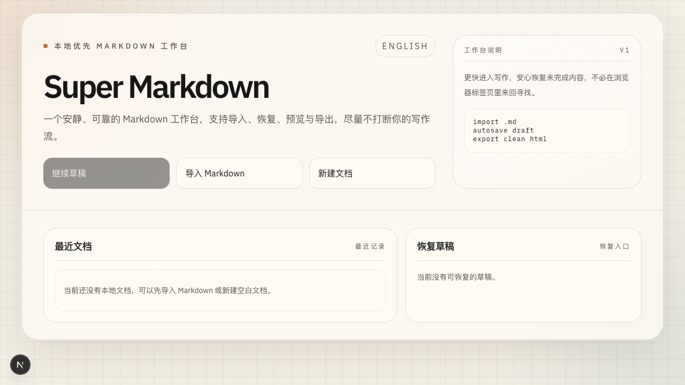

# Super Markdown Workbench

[](https://nextjs.org/)
[](https://www.typescriptlang.org/)
[](https://vitest.dev/)
[](https://playwright.dev/)
[](https://github.com/futurewego/super-typora/releases)

Super Markdown Workbench is a local-first Markdown web app built for fast editing, reliable autosave, and low-friction re-entry into unfinished work.

## Preview



## What V1 includes

- lightweight workbench homepage
- create blank documents
- import local `.md` files
- recent documents from browser storage
- recover last autosaved draft from home
- CodeMirror-based Markdown editor
- live preview with GFM support
- bilingual UI toggle (`中文 / English`)
- one-click fullscreen for `Editor` and `Preview`
- draggable editor / preview width
- autosave to IndexedDB
- export to `.md` and `.html`
- theme persistence

## Stack

- Next.js App Router
- React 19 + TypeScript
- Tailwind CSS v4
- Zustand
- IndexedDB via `idb`
- CodeMirror 6
- `react-markdown` + `remark-gfm`
- Vitest + Testing Library
- Playwright

## Run locally

```bash
npm install
npm run dev
```

Open `http://localhost:3000`.

## Test commands

```bash
npm run lint
npx vitest run
npx playwright test
npm run build
```

## Architecture notes

- `app/page.tsx` is the workbench entry route
- `app/editor/[docId]/page.tsx` is the editor route
- documents and draft snapshots are stored in IndexedDB
- lightweight preferences are stored in `localStorage`
- preview and export derive from the same Markdown source

## Deferred after V1

- user accounts
- cloud sync
- full-text search
- folders and tags
- collaboration
- AI-assisted formatting or summarization
